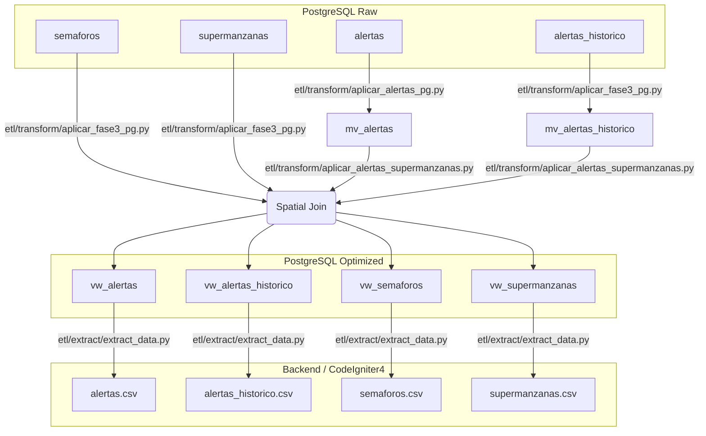

# Arquitectura de Datos: Esquema `semaforos_PT`

Este documento consolida la arquitectura completa del backend de datos para la plataforma de siniestralidad. Se detallan las tablas base, las vistas materializadas físicas preparadas para alto rendimiento interactivo, y el flujo (pipeline) implementado para su extracción y conexión con el Frontend (Streamlit).

## Diagrama del Ecosistema de Datos

El diseño final es un pipeline bidireccional que enriquece la base de datos con inferencias geoespaciales y luego extrae "listo para renderizar":

---

## 1. Orígenes de Datos (Tablas Base)

Las tablas originales en crudo dentro del esquema `semaforos_PT`. No deben manipularse desde el frontend ni extraerse directamente a la API debido a su estructura costosa y tamaño desproporcionado:

| Componente | Descripción | Problema Resuelto |
| :--- | :--- | :--- |
| **`alertas`** | Carga viva de reportes masivos de la API CIFS de Waze (+5.5M filas). Contiene reportes duplicados durante todo el lapso de vigencia de un evento. | Tamaño intratable para renderizado web. |
| **`alertas_historico`** | Respaldo del SIMO de incidentes históricos. Fechas vienen en formato `string` ("15 sept 2026") y coords ocultas en sintaxis WKT `Point(x y)`. | Expresiones regulares costosas para la BD limitaban graficación dinámica. |
| **`semaforos`** | Catastro de cruceros semaforizados con geometrías embebidas en crudo `bytea` (WKB). Sin asociación espacial predeterminada. | Imposibilidad de saber en qué área estadística/bloque se encuentra para filtrar. |
| **`supermanzanas`** | Traza urbana oficial conteniendo `pobtot` y polígonos `bytea` (WKB). | Los polígonos son geniales para graficar pero lentos para establecer centroides de click instintivo en la web. |

---

## 2. Motor de Transformación (Scripts Core)

Hemos abstraído todo el trabajo iterativo en dos scripts de `Python/SQLAlchemy`. Estos scripts inyectan la lógica espacial y matemática a PostgreSQL y **solo necesitan ejecutarse cuando ingresa un nuevo bloque gigante de datos**.

### `aplicar_alertas_pg.py`
Se encarga de la agregación de "Gaps and Islands". Agrupa espacialmente (resolución de 4 decimales = aprox 10 m) los millones de reportes de Waze que comparta mismo sub-tipo, si ocurren en ventanas continuas < 12 horas.
- Extrae la hora de la primera y última alerta del incidente continuo, calculando así `duracion_horas` de manera nativa.

### `aplicar_fase3_pg.py`
Procesa las partes que PostgreSQL puro no pudo hacer por carecer de PostGIS y el histórico:
- **Espacializador de Polígonos**: Usa *Shapely* y cruza los `semaforos` contra `supermanzanas`. Soporta la inexactitud de la vía pública usando `.distance()` (Radio de compensación hasta ~1km) evitando que semáforos se pierdan si están fuera del borde técnico de un polígono. Calcula además (`lat_centroide`, `lon_centroide`).
- **Limpiador de Históricos**: Convierte la costosa y caótica `alertas_historico` parseando todo localmente a PostgreSQL mediante SQL Nativo avanzado.

---

## 3. Capa de Alto Rendimiento (Base de Datos Optimizada)

El Dashboard **nunca lee el Crudo**. Se alimenta de este esquema de vistas físicas altamente optimizadas con Índices B-Tree incrustados en sus coordenadas y fechas para filtrado atómico.

> [!NOTE]
> Las vistas incluyen un diccionario nativo Español-Hardcodeado `(tipo, subtipo)` para homogenizar `JAM` y `HAZARD` de su origen inglés, incluyendo salvaguardias (`COALESCE`) por si Waze olvidó etiquetar sub-tipos.

### A. Alertas Actuales Optimizadas: `vw_alertas`
Tabla plana pre-calculada a partir de los eventos. Contiene a qué supermanzana pertenece cada alerta y agrupa reportes con base en el tiempo (< 12 hrs).
- *Columnas Principales*: `tipo`, `subtipo`, `latitud_aprox`, `longitud_aprox`, `primera_alerta`, `duracion_horas`, `id_supermanzana`.

### B. Alertas Histórico: `vw_alertas_historico`
Tabla optimizada con puntos calientes listos para mapear mediante calor interactivo. Incluye parseo de texto corrupto a fechas nativas y join a su respectiva supermanzana.
- *Columnas Principales*: `tipo`, `subtipo`, `lon_val`, `lat_val`, `fecha_cierre`, `id_supermanzana`.

### C. Tabla Pre-calculada: `vw_semaforos`
Semáforos listos para filtrar por Supermanzana.
- *Columnas Principales*: `id`, `Identificador`, `ubicacion`, `lat`, `lon`, `id_supermanzana`.

### D. Tabla Pre-calculada: `vw_supermanzanas`
Áreas de Cancún preparadas para reaccionar a clicks o centrado interactivo con centroides lat/lon ya disponibles.
- *Columnas Principales*: `id_supermanzana`, `pobtot`, `lat_centroide`, `lon_centroide`

---

## 4. Pipeline Final de Extracción (`extract_data.py`)

Antes, tu sistema tenía códigos fragmentados tratando de limpiar cosas sobre la marcha.

El nuevo pipeline final, `extract_data.py`, asume que el backend hace todo el trabajo fuerte. Simplemente acude a la base de datos PostgreSQL, lee las 4 vistas maestras optimizadas, y las expulsa a nivel de disco bajo el formato `CSV` respetando el esquema original de nombres (para no quebrar tu API de Streamlit):
- `data/semaforos_PT/alertas.csv`
- `data/semaforos_PT/alertas_historico.csv`
- `data/semaforos_PT/semaforos.csv`
- `data/semaforos_PT/supermanzanas.csv`

> [!TIP]
> **Orquestación**: La próxima vez que importes decenas de miles de reportes Waze o SM nuevas a PostgreSQL, simplemente corre en tu local Python los archivos `aplicar_alertas...` y `aplicar_fase3...`, seguidos de `extract_data.py`. Los mapas tendrán data actualizada mágicamente al instante sin tocar 1 sola línea de código del dashboard.
