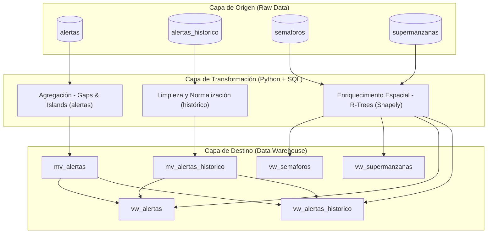
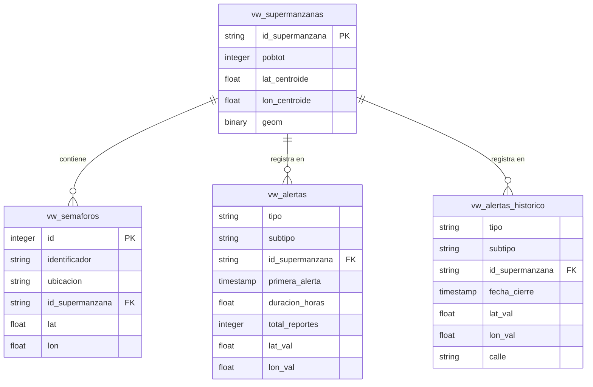

# Manual Técnico: Transformaciones y Arquitectura de Datos

Este documento detalla la ingeniería de datos aplicada al proyecto de Siniestralidad Vial. Aquí se explican los procesos de limpieza, normalización, enriquecimiento geoespacial y la estructura final del Data Warehouse (DW).

---

## 1. Arquitectura del Ecosistema (Data Pipeline)

El sistema opera bajo un flujo de **ETL (Extract, Transform, Load)** diseñado para desacoplar el origen de datos masivo del frontend interactivo.



---

## 2. Transformaciones Detalladas

### 2.1 Agregación de Alertas (Waze API)
**Objetivo:** Consolidar millones de reportes repetidos en "Eventos" únicos basados en proximidad espacio-temporal.

**Lógica Matemática:**
- **Clúster Espacial:** Redondeo de coordenadas a 4 decimales (~11 metros de precisión).
  - Formula: $\text{lat}_{\text{cluster}} = \text{ROUND}(\text{latitud}, 4)$
- **Ventana Temporal:** Se utiliza la técnica de *Gaps and Islands* detectando saltos mayores a 12 horas entre reportes de la misma categoría y ubicación.

**Consulta SQL (Simplificada):**
```sql
WITH marcadores AS (
    SELECT *,
        CASE WHEN (EXTRACT(EPOCH FROM (fecha - LAG(fecha) OVER (PARTITION BY tipo, subtipo, lat_cluster, lon_cluster ORDER BY fecha))) / 3600.0) > 12 
        THEN 1 ELSE 0 END AS es_nuevo
    FROM traducciones
),
grupos AS (
    SELECT *, SUM(es_nuevo) OVER (PARTITION BY tipo, subtipo, lat_cluster, lon_cluster ORDER BY fecha) AS evento_id
    FROM marcadores
)
SELECT tipo, subtipo, AVG(latitud) as lat, AVG(longitud) as lon, MIN(fecha) as inicio, MAX(fecha) as fin
FROM grupos
GROUP BY tipo, subtipo, lat_cluster, lon_cluster, evento_id;
```

---

### 2.2 Limpieza del Histórico (SIMO)
**Objetivo:** Convertir datos no estructurados (fechas en texto, puntos WKT) en tipos de datos nativos de alta velocidad.

- **Detección de Coordenadas:** Extracción por Expresiones Regulares (RegEx).
  - SQL: `CAST(SUBSTRING("Location" FROM '(?i)point\(([^ ]+)') AS DOUBLE PRECISION) AS lon_val`
- **Normalización de Fechas:** Traducción de meses en español ("dic", "sept") a estándares SQL para `TO_DATE()`.
- **Estandarización de Columnas:** Eliminación de campos redundantes en inglés (`Date`, `Country`, `City`, `Street`, `Location`, `Type`, `Subtype`) y unificación en `tipo` y `subtipo`.

---

### 2.3 Reglas de Negocio y Filtrado
**Objetivo:** Garantizar la integridad climática y geográfica de los datos.

Dado que la zona de estudio es **Benito Juárez, Quintana Roo**, se han implementado filtros permanentes en los scripts de transformación para descartar reportes inconsistentes con el clima tropical:

- **Exclusiones de Clima:** Se eliminan automáticamente registros con los siguientes subtipos:
  - `HAZARD_WEATHER_HEAVY_SNOW` (Nevada Intensa)
  - `HAZARD_WEATHER_SNOW` (Nieve)
  - `HAZARD_WEATHER_FREEZING_RAIN` (Lluvia Helada)
  - `HAZARD_ON_ROAD_ICE` (Hielo en Vía)

Estos registros se filtran tanto en la vista de eventos actuales (`mv_alertas`) como en el histórico (`mv_alertas_historico`) mediante cláusulas `WHERE` en SQL nativo.

---

## 3. Enriquecimiento Geoespacial (Spatial Join)

Dado que el motor no cuenta con PostGIS, se utiliza **Shapely STRtree (R-Tree)** para realizar uniones espaciales en memoria.

**Fórmula de Asignación:**
Para cada punto $P$ (Alertas/Semáforos) y cada polígono $S$ (Supermanzanas):
1. Se consulta el índice espacial para candidatos que intersecan.
2. Si no hay intersección directa (puntos en calles externas), se calcula la **distancia mínima (Haversine/Euclidean)**.
3. Se asigna la Supermanzana si $Dist(P, S) < 0.01^\circ$ (~1.1 km).

---

## 4. Diagrama del Data Warehouse (ERD)

Este diagrama representa la relación entre las tablas optimizadas del Data Warehouse.



---

## 5. Funcionamiento del Data Warehouse

1. **Capa Raw:** Almacenamiento de logs de API y archivos históricos masivos.
2. **Capa Materializada (Speed Layer):** Vistas como `mv_alertas` y `mv_alertas_historico` que pre-calculan agregaciones complejas que SQL hace mejor (Gaps & Islands).
3. **Capa Física (Performance Layer):** Tablas como `vw_alertas` inyectadas por Python que ya contienen el `id_supermanzana` y centroides, eliminando la necesidad de cálculos espaciales en el Dashboard.

> [!NOTE]
---

## 6. Diccionario de Terminología (Catalogación Waze)

A continuación se detallan las definiciones oficiales y operativas para los tipos y subtipos de incidentes procesados en el sistema:

### 6.1 Categoría: Accidentes (ACCIDENT)
*   **Accidente Mayor:** Siniestro vial de gran magnitud que requiere la presencia de múltiples unidades de emergencia y bloquea gran parte de la vía.
*   **Accidente Menor:** Choque por alcance o rozamiento con daños materiales leves y afectación mínima al flujo vehicular.
*   **Accidente:** Reporte genérico de siniestro vial sin clasificación de gravedad al momento de la captura.

### 6.2 Categoría: Tráfico (JAM)
*   **Tráfico Detenido:** Flujo nulo. Los vehículos permanecen estacionarios por varios minutos.
*   **Tráfico Pesado:** Circulación a muy baja velocidad con paradas frecuentes.
*   **Tráfico Moderado:** Velocidad reducida pero constante.
*   **Tráfico Ligero:** Leve aumento en la densidad vehicular sin afectar significativamente los tiempos de traslado.

### 6.3 Categoría: Cierres Viales (ROAD_CLOSED)
*   **Vía Cerrada (Evento):** Bloqueo total debido a actividades programadas (desfiles, maratones, actos públicos).
*   **Vía Cerrada (Obras):** Interrupción del tránsito por trabajos de mantenimiento, pavimentación o reparación de infraestructura.
*   **Vía Cerrada (Peligro):** Cierre preventivo por situaciones de alto riesgo como cables caídos, fugas de gas o estructuras inestables.

### 6.4 Categoría: Peligros y Clima (HAZARD)
*   **Bache:** Desperfecto profundo en la carpeta asfáltica que puede causar daños mecánicos.
*   **Inundación:** Acumulación crítica de agua pluvial que rebasa la banqueta o impide el paso de vehículos pequeños.
*   **Objeto en Vía:** Presencia de escombros, llantas, carga caída u otros elementos que obstruyen el carril.
*   **Semáforo Descompuesto:** Falla en el ciclo de luces o apagón total de una intersección semaforizada.
*   **Obras Viales:** Presencia de personal y maquinaria trabajando en la vía sin cierre total de la misma.
*   **Vehículo de Emergencia:** Presencia de ambulancias, bomberos o patrullas atendiendo una situación.
*   **Clima Adverso:** Condiciones meteorológicas que reducen la visibilidad o el agarre (Lluvia intensa, vientos fuertes).

---

> [!TIP]
> **Uso del Diccionario:** Esta terminología es la que se visualiza en los filtros y leyendas del Dashboard de Streamlit. Cualquier nuevo subtipo detectado en la API deberá ser añadido a este catálogo mediante los scripts de transformación.
